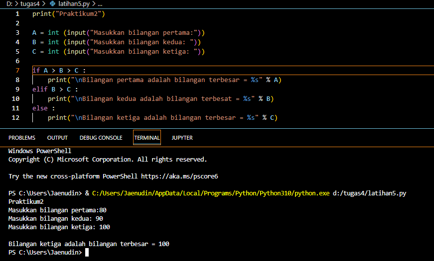

# pertemuan7 

# LATIHAN 1
## => TUGAS MEMBUAT PROGRAM SEDERHANA DENGAN INPUT 2 BUAH BILANGAN

## Source Code Dan Hasil Running
```
x = int(input('masukan bilangan pertama : '))
y = int(input('masukan bilangan kedua : '))
if x > y:
    print('Bilangan terbesar = ', x)
else:
    print('bilangan terbesar = ', y)
```


## => MEMBUAT PROGRAM UNTUK MENGURUTKAN DATA BERDASARKAN INPUT SEJUMLAH DATA (minimal 3 variable input atau lebih)

## Source Code Dan Hasil Running
```
a = int(input('bilangan ke-1 = '))
b = int(input('bilangan ke-2 = '))
c = int(input('bilangan ke-3 = '))
if a < b:
    if b < c:
        print('urutan bilangan : ', a, b, c)
    else:
        if a < c:
            print('urutan bilangan : ', a, c, b)
        else:
            print('urutan bilangan : ', c, a, b)
else:
    if a < c:
        print('urutan bilangan :', b, a, c)
    else: 
        if b < c:
            print('uruta bilangan : ', b, c, a)
        else:
            print('urutan bilangan : ', c, b, a)
```


## => MEMBUAT PROGRAM DENGAN PERULANGAN BERTINGKAT (nested)

## Source Code Dan Hasil Running
```
for i in range(0, 10):
    for j in range(0, 10):
        product = i+j
        print(f"{product:>3}", end='')
    print()
```


## => TAMPILKAN N BIANGAN ACAK YANG LEBIH KECIL DARI 0.5

## Source Code Dan Hasil Running
```
print("mulai")

print ("masukan nilai N: 5 ")
import random
jumlah = 5
a = 0 
for x in range (jumlah):
    i = random.uniform(0.0,0.5)
    a+=1
    print('data ke :',a,'==>', i)

print("*****SELESAI*****")
```


# PRAKTIKUM 2
## => TUGAS MEMBUAT PROGRAM SEDERHANA DENGAN INPUT 3 BUAH BILANGAN

## Source Code Dan Hasil Running
```
print("Praktikum2")

A = int (input("Masukkan bilangan pertama:"))
B = int (input("Masukkan bilangan kedua: "))
C = int (input("Masukkan bilangan ketiga: "))

if A > B > C :
    print("\nBilangan pertama adalah bilangan terbesar = %s" % A)
elif B > C :
    print("\nBilangan kedua adalah bilangan terbesat = %s" % B)
else :
    print("\nBilangan ketiga adalah bilangan terbesar = %s" % C)
```


## => FLOWCHART <=
(1).MULAI
(2).INISIASI BIL1,BIL2,BIL3 SEBAGAI INTEGER
(3).BACA BIL1
(4).BACA BIL2
(5).BACA BIL3
(6).JIKA BIL1 > BIL2 DAN BIL1 > BIL3 MAKA KERJAKAN LANGKAH 8, SELAIN ITU
(7).JIKA BBIL2 > BIL1 DAN BIL2 > BIL3 MAKA KERJAKAN LANGKAH 9, SELAIN SELAIN ITU KERJAKAN LANGKAH 10.
(8).CETAK "BILANGAN TERBESAR BILANGAN PERTAMA".
(9).CETAK "BILANGAN TERBESAR BILANGAN KEDUA".
(10).CETAK "BILANGAN TERBESAR BILANGAN KETIGA".
(11).SELESAI


# PRAKTIKUM 3
## => TUGAS MEMBUAT PROGRAM UNTUK MENAMPILKAN BILANGAN TERBESAR DARI N BUAH DATA YANG DIINPUTKAN

## Source Code Dan Hasil Running
```
print("azra")
n=1
a=0
while n !=0:

    if n > a:
        a = n
    n = int(input("masukanbilangan: "))

    if n == 0:
        break
print("nilai terbesarnya adalah:",a)
```


## => TUGAS MEMBUAT PROGRAM SEDERAHANA DENGAN PERULANGAN

## Source Code Dan Hasil Running
```
n = 100000000
sum = 0
y = 0
laba = [int(0), int(0), int(n) * 0.01, int(n) * 0.01, int(n) *
    0.05, int(n) * 0.05, int(n) * 0.05, int(n) * 0.02]
for i in laba:
    sum = sum+i
    y += 1
    print('laba bulan ke-', y, 'sebesar : ', i)
print('total laba adalah : ', sum)
```


